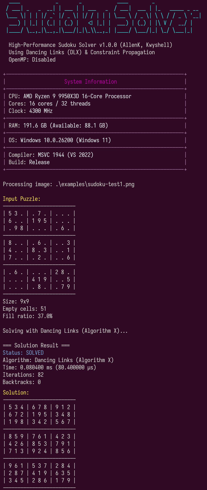

# Sudoku Solver - High-Performance Sudoku Solver

A high-performance, cross-platform Sudoku solver featuring multiple algorithms, OCR image recognition, and comprehensive benchmarking tools.



## Features

- **Multiple Algorithms**
  - Dancing Links (DLX) - Donald Knuth's Algorithm X implementation
  - Backtracking with Constraint Propagation
  - Automatic algorithm comparison

- **OCR Support**
  - Extract puzzles from images (PNG, JPG, BMP, TIFF)
  - Supports 9x9 and 16x16 grids
  - Automatic grid detection and perspective correction

- **Benchmarking**
  - Single-threaded and multi-threaded benchmarks
  - System information detection (CPU, RAM, OS)
  - Performance metrics: throughput, speedup, efficiency
  - Professional benchmark reports

- **Flexible Input/Output**
  - JSON puzzle format
  - String-based puzzle input
  - Image input via OCR
  - Solution export to JSON

## Quick Start

### Prerequisites

- CMake 3.20+
- C++20 compatible compiler (MSVC 2022, GCC 11+, Clang 14+)
- vcpkg package manager (Windows Platform)

### Setup vcpkg

```powershell
# Clone vcpkg
git clone https://github.com/microsoft/vcpkg.git
cd vcpkg
.\bootstrap-vcpkg.bat

# Set environment variable
$env:VCPKG_ROOT = "C:\path\to\vcpkg"
[System.Environment]::SetEnvironmentVariable("VCPKG_ROOT", $env:VCPKG_ROOT, "User")

# Install static triplet dependencies
.\vcpkg install opencv4:x64-windows-static
.\vcpkg install tesseract:x64-windows-static
.\vcpkg install nlohmann-json:x64-windows-static
.\vcpkg install cli11:x64-windows-static

or Using vcpkg.json
```

### Build

```bash
# Clone repository
git clone https://github.com/user/sudoku-solver.git
cd sudoku-solver

# Configure with vcpkg
cmake -B build -S . -DCMAKE_TOOLCHAIN_FILE=[vcpkg-root]/scripts/buildsystems/vcpkg.cmake

# Build
cmake --build build --config Release

# Install
cmake --install build --prefix ./install
```

### Usage

```bash
# Solve a puzzle from JSON
SudokuSolver -i puzzle.json

# Solve from image (OCR)
SudokuSolver -i sudoku.png

# Compare algorithms
SudokuSolver -i puzzle.json -a compare

# Run benchmark
SudokuSolver -i puzzle.json -b 1000

# Multi-threaded benchmark (auto-detect threads)
SudokuSolver -i puzzle.json -b 1000 -w 0

# Show system info
SudokuSolver -s
```

### Command Line Options

| Option | Description |
|--------|-------------|
| `-i, --input <file>` | Input file (JSON or image) |
| `-a, --algorithm <algo>` | Algorithm: `dlx`, `backtrack`, `compare` |
| `-b, --benchmark <N>` | Run benchmark with N iterations |
| `-w, --workers <N>` | Number of parallel workers (0 = auto) |
| `-o, --output <file>` | Output solution to JSON file |
| `-s, --sysinfo` | Show system information |
| `-u, --unique` | Check if solution is unique |
| `-v, --verbose` | Verbose output |
| `-q, --quiet` | Minimal output |

## Benchmark Results

### Test Environment

| System | CPU | Cores/Threads | RAM | OS |
|--------|-----|---------------|-----|-----|
| System A | AMD Ryzen 9 9950X3D | 16C / 32T | 192 GB DDR5 | Windows 11 |
| System B | AMD Ryzen 7 5800X | 8C / 16T | 64 GB DDR4 | Windows 11 |

### 16x16 Puzzle Performance (320,000 total solves)

| Algorithm | System | Throughput | Speedup | Efficiency |
|-----------|--------|------------|---------|------------|
| DLX | 9950X3D (32T) | **23,075 /s** | 19.87x | 62.10% |
| DLX | 5800X (16T) | 7,558 /s | 9.16x | 57.27% |
| Backtracking | 9950X3D (32T) | 9,393 /s | 15.83x | 49.48% |
| Backtracking | 5800X (16T) | 2,731 /s | 7.03x | 43.96% |

### 9x9 Puzzle Performance - AI Escargot (320,000 total solves)

| Algorithm | System | Throughput | Speedup | Efficiency |
|-----------|--------|------------|---------|------------|
| Backtracking | 9950X3D (32T) | **204,557 /s** | 8.93x | 27.91% |
| Backtracking | 5800X (16T) | 79,343 /s | 6.13x | 38.33% |
| DLX | 9950X3D (32T) | 185,747 /s | 15.09x | 47.17% |
| DLX | 5800X (16T) | 67,983 /s | 8.30x | 51.88% |

### Performance Comparison: 9950X3D vs 5800X

| Metric | Ratio | Reference |
|--------|-------|-----------|
| **Sudoku Multi-Core** | **2.95x** | Our benchmark |
| Cinebench R23 Multi | 2.78x | Industry standard |
| Cinebench R23 Single | 1.40x | Industry standard |

### Key Findings

- **DLX excels in multi-threaded scenarios** with 50-62% efficiency
- **Backtracking is faster for single-threaded 9x9** due to cache-friendly memory access
- **Larger puzzles (16x16+) benefit more from DLX** algorithm
- **Multi-threading efficiency decreases with smaller puzzles** due to task granularity

## JSON Format

### Array Format
```json
{
  "puzzle": [
    [5, 3, 0, 0, 7, 0, 0, 0, 0],
    [6, 0, 0, 1, 9, 5, 0, 0, 0],
    ...
  ]
}
```

### String Format
```json
{
  "puzzle": "530070000600195000098000060800060003400803001700020006060000280000419005000080079"
}
```

### With Custom Dimensions
```json
{
  "size": 16,
  "box_rows": 4,
  "box_cols": 4,
  "puzzle": [...]
}
```

## Algorithm Details

### Dancing Links (DLX)

Implementation of Donald Knuth's Algorithm X using the Dancing Links technique. Optimal for:
- Large puzzles (16x16+)
- Multi-threaded execution
- Finding all solutions

### Backtracking with Constraint Propagation

Classic backtracking enhanced with:
- Naked singles detection
- Hidden singles detection
- MRV (Minimum Remaining Values) heuristic

Optimal for:
- Small puzzles (9x9)
- Single-threaded execution
- Quick single solution

## Project Structure

```
sudoku-solver/
├── include/
│   ├── board.hpp           # Board representation
│   ├── solver.hpp          # Solver interface
│   ├── solver_dlx.hpp      # DLX implementation
│   ├── solver_backtrack.hpp # Backtracking implementation
│   ├── ocr_processor.hpp   # OCR processing
│   ├── benchmark.hpp       # Benchmarking utilities
│   ├── system_info.hpp     # System detection
│   ├── json_handler.hpp    # JSON I/O
│   └── types.hpp           # Common types
├── src/
│   ├── main.cpp
│   ├── board.cpp
│   ├── solver_dlx.cpp
│   ├── solver_backtrack.cpp
│   ├── ocr_processor.cpp
│   ├── benchmark.cpp
│   ├── system_info.cpp
│   └── json_handler.cpp
├── examples/               # Sample puzzles
├── docs/                   # Documentation
├── CMakeLists.txt
├── vcpkg.json             # Dependencies
└── README.md
```

## Dependencies

Managed via vcpkg:

- **OpenCV** - Image processing and OCR preprocessing
- **Tesseract** - OCR engine
- **nlohmann/json** - JSON parsing
- **CLI11** - Command line parsing

## Building with OpenMP (Optional)

```bash
cmake -B build -S . -DENABLE_OPENMP=ON
```

## Compatibility

| Platform | Status |
|----------|--------|
| Windows 11/10 | ✅ Tested |
| Windows 7/8 | ✅ Compatible |
| Linux | ✅ Compatible |

## License

MIT License

## Authors

- **AllenK**
- **Kwyshell**

## Acknowledgments

- Donald Knuth for the Dancing Links algorithm
- The Tesseract OCR project
- OpenCV community
